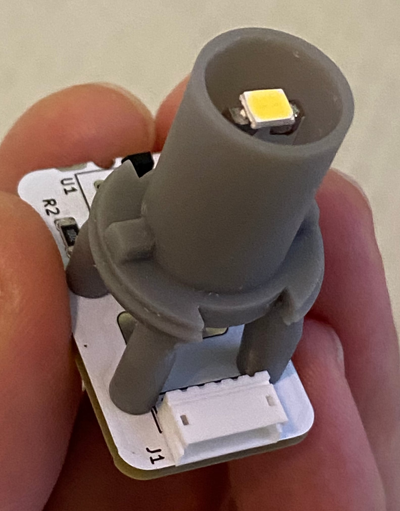
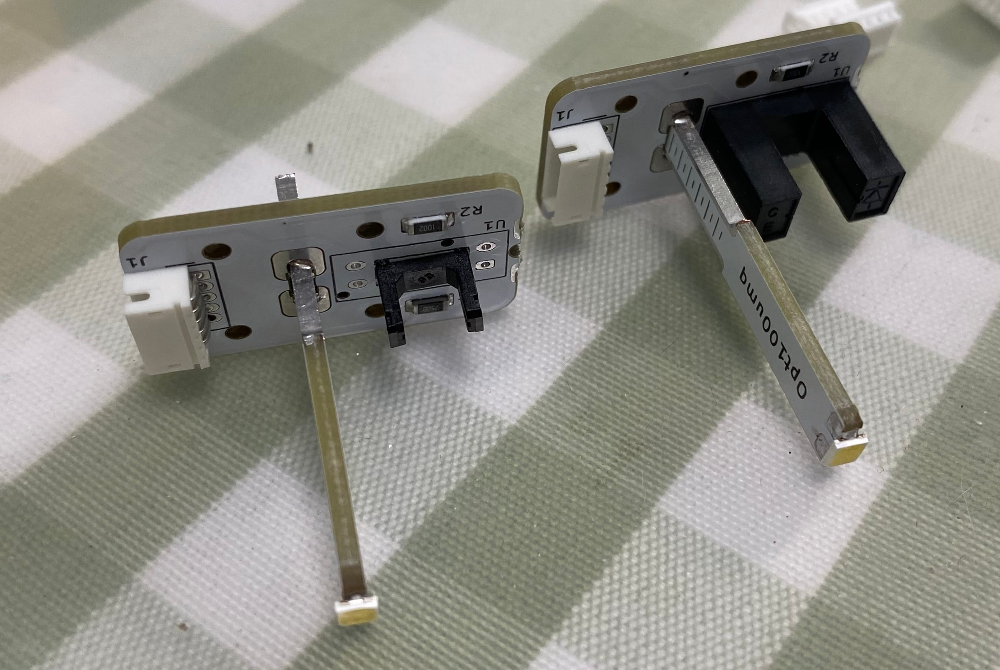

# Optical sensor mod for Sanwa buttons (such as buttons for Pop'n Music, SDVX or IIDX) 

    

<video src="https://user-images.githubusercontent.com/11623830/221199948-686cd2df-5dc8-4df0-8924-246d5ef216d3.MP4" controls="controls" width="50%">
</video>

Traditional Sanwa buttons used in arcade use micro switches which wear out through time.
This project creates a optical sensor module that can replace the whole original lamp/switch holder and the microswitch. It almost never wears out.

I build it originally for my Pop'n Music controller, the Sanwa OBSA-100UMP button. And it turned out Sanwa has its own standard and my design works for many other Sanwa buttons such as SDVX and IIDX.

## PCB
The PCB contains the optical sensor part and the LED lamp part, you need to cut the lamp part from the main board.

For the optical sensor, the PCB supports both ITR1203 (inner pins) and discrete IR908-7C and PT908-7C pair (the outer pins). If you use discreate IR pairs, note that the IR emitter IR908-7C should be at the "U1" sign side, PT908-7C phototransistor should be at the opposite side.

* R1 is the current limiter for the emitter, 1206, 220 to 500ohm, depending on supply voltage. See notes below for calculation.
* R2 is for pulling down the out level, 1206 or 0805, 2K to 3K ohm, make sure the out level is high enough when button is not pressed (optical switch is on), if it's not high enough, increase R2 value.
* R3 is the current limiter for the LED lamp, depending on the brightness of the LED, 1206, 50ohm to 200ohm is fine.
* For the LED, choose 2835 or 3528 3V high brightness LEDs.

Notes:
* Here's how you can calculate the LED current limiter R3:
  * R3 = (V_supply - V_F) / I
  * LED V_F is usually around 3V. LED's current is usually 20mA for high brightness LEDs.
  * So R3 = (5V - 3V) / 0.02A = 100 ohm for a 5V supply.
* Same formular for the IR emitter current:
  * I = (V_supply - Vf_IR) / R1
  * IR emitter Vf is usually around 1.2V. IR emitter's current is usually 10 to 20mA.
  * So R1 = (5V - 1.2V) / 0.02A = 190 ohm, you can use a standard 220 ohm resistor.

## Holder
You need to print out the holder.stl. A resin printer is perfect for this. I'm not sure if an FDM printer with PLA has enough accuracy to do the work.

## Installation
1. Solder the lamp part onto the main board.
2. Use M1.8*8 screws to fix the board onto the holder.
3. Remove old lamp/switch holder from the button.
4. Push this new optical sensor back into the button.

## Sorry for the ZHR-5 interface
The interface to the mainboard is a ZHR-5, which is compatible with Sanwa's own buttons with optical sensors. I haven't made other types of interfaces yet. Maybe I will in the future.

* Good Luck! *

